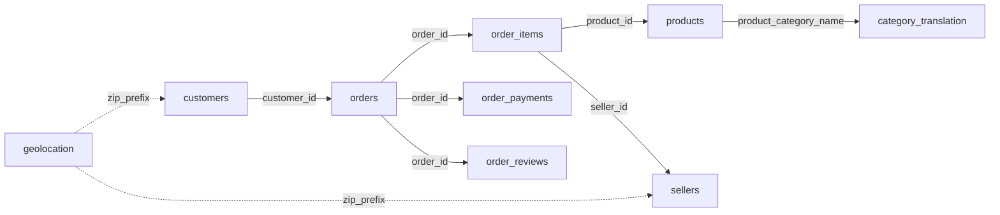

# T12 - Thiết kế NoSQL MongoDB cho Olist

**Deliverable:** ER/Document Design & Denormalization Strategy  
**Nguồn đầu vào:** `Olist_Data_Dictionary_T02.xlsx` (T02 - kiểm tra 9 file CSV và schema)  
**Công nghệ:** MongoDB  
**Phụ trách:** TV2 (phối hợp TV1)

## 1. Mục tiêu thiết kế

T12 chuyển mô hình dữ liệu Olist dạng nhiều bảng CSV sang mô hình document phù hợp MongoDB. Thiết kế ưu tiên các truy vấn phân tích ở T15, giảm số lần `$lookup`, giữ document không phình quá mức và vẫn bảo toàn khả năng truy vết tới `product_id`, `seller_id`.

**Nguyên tắc chính:** lấy `orders` làm collection trung tâm; embed dữ liệu phụ thuộc trực tiếp vào đơn hàng; giữ `products`, `sellers`, `zip_geolocation` làm collection tham chiếu; denormalize một số thuộc tính thường dùng vào `orders.items[]`.

## 2. Quan hệ nguồn từ T02



T02 cho thấy các điểm cần xử lý khi chuyển sang MongoDB: `geolocation` có 261,831 dòng trùng chính xác; review có NULL lớn ở hai trường bình luận; một số mốc thời gian của `orders` có thể NULL; metadata sản phẩm có thể thiếu; các cột thời gian hiện đang đọc dạng chuỗi và cần parse sang datetime.

## 3. Mô hình MongoDB đích

Đề xuất **4 collections**:

1. `orders` - collection trung tâm, chứa customer snapshot và embed `items`, `payments`, `reviews`.
2. `products` - master/reference của sản phẩm; bảng dịch danh mục được merge vào đây.
3. `sellers` - master/reference của người bán.
4. `zip_geolocation` - dữ liệu địa lý đã deduplicate/aggregate theo zip prefix.

```mermaid
graph LR
  O[orders<br/>customer{}<br/>items[]<br/>payments[]<br/>reviews[]] -->|items.product_id| P[products]
  O -->|items.seller_id| S[sellers]
  O -. customer.zip_prefix .-> G[zip_geolocation]
  S -. zip_prefix .-> G
```

## 4. Schema collection `orders`

```javascript
{
  _id: "<order_id>",
  schema_version: 1,
  status: "delivered",
  customer: {
    customer_id: "<customer_id>",
    customer_unique_id: "<customer_unique_id>",
    zip_code_prefix: 14409,
    city: "franca",
    state: "SP"
  },
  timestamps: {
    purchase: ISODate("2017-10-02T10:56:33Z"),
    approved: ISODate("2017-10-02T11:07:15Z"),
    delivered_carrier: ISODate("2017-10-04T19:55:00Z"),
    delivered_customer: ISODate("2017-10-10T21:25:13Z"),
    estimated_delivery: ISODate("2017-10-18T00:00:00Z")
  },
  items: [
    {
      order_item_id: 1,
      product_id: "<product_id>",
      seller_id: "<seller_id>",
      shipping_limit_date: ISODate("2017-10-06T11:07:15Z"),
      price: NumberDecimal("29.99"),
      freight_value: NumberDecimal("8.72"),
      product_snapshot: {
        category_name: "beleza_saude",
        category_name_english: "health_beauty"
      },
      seller_snapshot: {
        city: "sao paulo",
        state: "SP"
      }
    }
  ],
  payments: [
    {
      payment_sequential: 1,
      payment_type: "credit_card",
      payment_installments: 1,
      payment_value: NumberDecimal("38.71")
    }
  ],
  reviews: [
    {
      review_id: "<review_id>",
      review_score: 5,
      review_comment_title: null,
      review_comment_message: null,
      review_creation_date: ISODate("2017-10-11T00:00:00Z"),
      review_answer_timestamp: ISODate("2017-10-12T03:43:48Z")
    }
  ]
}
```

### Kiểu dữ liệu đề xuất

| Nhóm trường | BSON type |
|---|---|
| ID, status, city/state, category | `string` |
| Zip prefix, sequence, installments, score | `int` |
| Tiền (`price`, `freight_value`, `payment_value`) | `decimal` (Decimal128) |
| Tọa độ/kích thước | `double` |
| Thời gian | `date` |
| Trường thiếu hợp lệ | `null` hoặc missing theo validator |

## 5. Supporting collections

### `products`

```javascript
{
  _id: "<product_id>",
  category: {
    name_pt: "beleza_saude",
    name_en: "health_beauty"
  },
  name_length: 40,
  description_length: 287,
  photos_qty: 1,
  dimensions: {
    weight_g: 500.0,
    length_cm: 19.0,
    height_cm: 8.0,
    width_cm: 13.0
  }
}
```

### `sellers`

```javascript
{
  _id: "<seller_id>",
  zip_code_prefix: 13023,
  city: "campinas",
  state: "SP"
}
```

### `zip_geolocation`

```javascript
{
  _id: 13023,
  centroid: {
    type: "Point",
    coordinates: [-47.0626, -22.9056]
  },
  city: "campinas",
  state: "SP",
  source_points_count: 12
}
```

`zip_geolocation` được tạo sau khi bỏ exact duplicates và gom theo zip prefix. Tọa độ centroid có thể lấy trung bình lat/lng; city/state lấy mode hoặc quy tắc chuẩn hóa đã thống nhất ở bước ETL.

## 6. Chiến lược denormalization

| Dữ liệu | Quyết định | Lý do |
|---|---|---|
| `order_items` | Embed vào `orders.items[]` | Thuộc vòng đời đơn hàng, thường đọc/aggregate cùng order |
| `order_payments` | Embed vào `orders.payments[]` | Một đơn có thể nhiều payment, nhưng payment không có ý nghĩa độc lập |
| `order_reviews` | Embed vào `orders.reviews[]` | Truy vấn review thường đi cùng order; dùng array để an toàn khi có nhiều review |
| Customer | Embed snapshot vào `orders.customer` | Trong Olist, `customer_id` gắn với bản ghi order; `customer_unique_id` vẫn dùng để group khách hàng qua nhiều order |
| Product | Reference bằng `product_id` + embed category snapshot | Tránh copy toàn bộ metadata; vẫn hỗ trợ aggregation theo category mà không `$lookup` |
| Seller | Reference bằng `seller_id` + embed city/state snapshot | Tránh copy toàn bộ seller nhưng hỗ trợ phân tích theo vùng |
| Category translation | Merge vào `products` và snapshot item | Bảng tra cứu nhỏ, dữ liệu gần như tĩnh; loại bỏ một lookup lặp lại |
| Geolocation | Collection riêng, aggregate theo zip prefix | Raw geolocation lớn và có nhiều duplicate; không nên embed toàn bộ |

Thiết kế snapshot phù hợp vì bộ Olist là dữ liệu lịch sử, ít có nhu cầu cập nhật ngược metadata cũ. Nếu xây hệ thống giao dịch realtime, cần chính sách đồng bộ snapshot chặt hơn.

## 7. Index đề xuất

```javascript
db.orders.createIndex({ "customer.customer_unique_id": 1 })
db.orders.createIndex({ "timestamps.purchase": 1 })
db.orders.createIndex({ "status": 1 })
db.orders.createIndex({ "items.product_id": 1 })
db.orders.createIndex({ "items.seller_id": 1 })
db.orders.createIndex({ "items.product_snapshot.category_name_english": 1 })
db.products.createIndex({ "category.name_en": 1 })
db.sellers.createIndex({ "state": 1 })
db.zip_geolocation.createIndex({ "centroid": "2dsphere" })
```

Không nên tạo toàn bộ index ngay từ đầu. T13/T14 có thể tạo index cốt lõi; T15 dùng `explain()` để xác định index nào thực sự có lợi.

## 8. Quy tắc ETL kế thừa từ T02

- Parse tất cả cột timestamp từ `string` sang BSON `date`.
- `orders.order_approved_at`, `order_delivered_carrier_date`, `order_delivered_customer_date` cho phép `null`.
- `review_comment_title` và `review_comment_message` cho phép `null`; không coi là lỗi dữ liệu.
- Product category/metadata cho phép thiếu theo schema T02.
- `geolocation`: bỏ 261,831 exact duplicated rows trước khi aggregate theo zip prefix.
- `product_category_name_translation` được join vào `products` trước khi load MongoDB.
- Dữ liệu tiền dùng Decimal128 nếu pipeline hỗ trợ; nếu T14 dùng PySpark/connector không tiện Decimal128, có thể giữ `double` nhất quán và ghi rõ quyết định kỹ thuật.

## 9. Mapping 9 CSV sang MongoDB

| File nguồn | Đích |
|---|---|
| `olist_orders_dataset.csv` | Root của `orders` |
| `olist_customers_dataset.csv` | `orders.customer` |
| `olist_order_items_dataset.csv` | `orders.items[]` |
| `olist_order_payments_dataset.csv` | `orders.payments[]` |
| `olist_order_reviews_dataset.csv` | `orders.reviews[]` |
| `olist_products_dataset.csv` | `products` + snapshot category trong item |
| `product_category_name_translation.csv` | Merge vào `products.category.name_en` |
| `olist_sellers_dataset.csv` | `sellers` + seller snapshot trong item |
| `olist_geolocation_dataset.csv` | `zip_geolocation` sau dedupe/aggregate |

## 10. Truy vấn T15 mà thiết kế này hỗ trợ tốt

- Doanh thu theo tháng: unwind `items`, group theo `timestamps.purchase`.
- Top sản phẩm / top danh mục: unwind `items`, group theo `product_id` hoặc category snapshot.
- Doanh thu theo seller/state: unwind `items`, group theo `seller_id`/seller snapshot.
- Phân bố phương thức thanh toán: unwind `payments`.
- Điểm review trung bình theo category/seller: unwind `items` + `reviews`, không cần lookup cho category/seller state.
- Phân tích khách hàng mua lại: group theo `customer.customer_unique_id`.

## 11. Definition of Done cho T12

- [x] Mapped đủ 9 CSV từ T02 sang mô hình MongoDB.
- [x] Xác định collection trung tâm và supporting collections.
- [x] Xác định field/type/nullable chính.
- [x] Có chiến lược embed/reference/denormalization và lý do.
- [x] Có xử lý các vấn đề NULL/duplicate/datetime phát hiện ở T02.
- [x] Có đề xuất index phục vụ T15.
- [x] Thiết kế sẵn sàng bàn giao cho T13 (MongoDB Docker) và T14 (import/load dữ liệu).

### Git đề xuất

```bash
git checkout main
git pull
git checkout -b feature/t12-nosql-design

git add docs/T12_MongoDB_Document_Design.md
git commit -m "docs: add MongoDB document design for T12"
git push -u origin feature/t12-nosql-design
```
